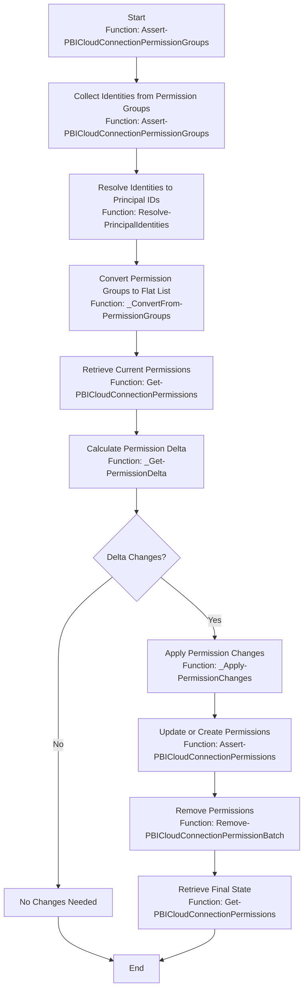
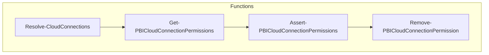

# ZeroFailed.Deploy.PowerBI

A [ZeroFailed](https://github.com/zerofailed/ZeroFailed) extension that provides deployment features targetted at the Power BI cloud platform.

## Overview

| Component Type | Included | Notes               |
|----------------|----------|---------------------|
| Tasks          | yes      | |
| Functions      | yes      | |
| Processes      | no       | Designed to be compatible with the default process provided by the [ZeroFailed.Deploy.Common](https://github.com/zerofailed/ZeroFailed.Deploy.Common) extension |

For more information about the different component types, please refer to the [ZeroFailed documentation](https://github.com/zerofailed/ZeroFailed/blob/main/README.md#extensions).

This extension consists of the following feature groups, click the links to see their documentation:

- Shared Cloud Connections (inc. permissions)

## Dependencies

| Extension                | Reference Type | Version |
|--------------------------|----------------|---------|
| ZeroFailed.Deploy.Common | git            | `main`  |

## Permission Management Flow

The following diagram illustrates the flow of permission management in the `Assert-PBICloudConnectionPermissionGroups` function:

## Cloud Connection Management Flow

The following diagram illustrates the flow for managing cloud connections, including resolving configurations, retrieving permissions, ensuring role assignments, and exporting connections. Each step corresponds to a specific function in the module.

### Configuration Model Overview

#### 1. **Main Configuration (`config.yaml`)**
- **Purpose**: Centralized configuration file referencing other YAML files.
- **Key Fields**:
  - `version`: Configuration version (e.g., `'1.0'`).
  - `configurationFiles`: References to other configuration files:
    - `servicePrincipals`: Path to service principals configuration.
    - `connectionTargets`: Path to connection targets configuration.
    - `connections`: List of connection group files (e.g., `development`, `testing`, `special-purpose`).
  - `settings`: Global settings:
    - `defaultTenantId`: Default Azure tenant ID.

#### 2. **Connection Targets (`connectionTargets.yaml`)**
- **Purpose**: Defines reusable connection targets.
- **Key Fields**:
  - `connectionTargets`: Grouped by target type (e.g., `blobStorage`, `sqlServer`).
    - Each target includes environment-specific configurations (e.g., `dev`, `test`).

#### 3. **Service Principals (`servicePrincipals.yaml`)**
- **Purpose**: Defines service principal credentials for different environments.
- **Key Fields**:
  - `servicePrincipals`: Grouped by environment (e.g., `development`, `test`).
    - Each entry includes:
      - `clientId`: Service principal client ID.
      - `secretUrl`: URL to the secret in Azure Key Vault.
      - `tenantId`: Azure tenant ID.

#### 4. **Connection Groups**
- **Purpose**: Define cloud connections for specific environments or purposes.
- **Files**:
  - **Development (`connections/development.yaml`)**
    - **Purpose**: Connections for the development environment.
    - **Key Fields**:
      - `cloudConnections`: List of connections.
        - `displayName`: Connection name.
        - `type`: Connection type (e.g., `AzureBlobs`, `SQL`).
        - `useServicePrincipal`: Reference to a service principal.
        - `target`: Reference to a connection target.
        - `permissions`: Defines `owners`, `users`, and `reshareUsers`.
  - **Special Purpose (`connections/special-purpose.yaml`)**
    - **Purpose**: Custom connections for special use cases.
    - **Key Fields**:
      - Similar to `development.yaml`, but may include inline `servicePrincipal` and `target` definitions.