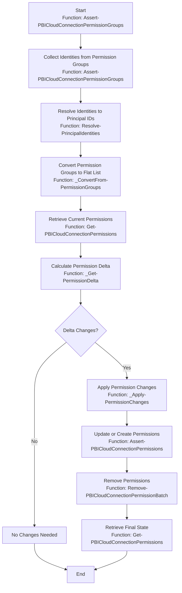
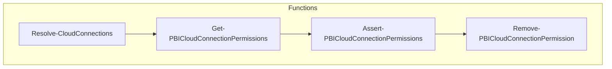

# ZeroFailed.Deploy.PowerBI

A [ZeroFailed](https://github.com/zerofailed/ZeroFailed) extension that provides deployment features targetted at the Power BI cloud platform.

## Overview

| Component Type | Included | Notes               |
|----------------|----------|---------------------|
| Tasks          | yes      | |
| Functions      | yes      | |
| Processes      | no       | Designed to be compatible with the default process provided by the [ZeroFailed.Deploy.Common](https://github.com/zerofailed/ZeroFailed.Deploy.Common) extension |

For more information about the different component types, please refer to the [ZeroFailed documentation](https://github.com/zerofailed/ZeroFailed/blob/main/README.md#extensions).

This extension consists of the following feature groups, click the links to see their documentation:

- Shared Cloud Connections (inc. permissions)

## Dependencies

| Extension                | Reference Type | Version |
|--------------------------|----------------|---------|
| ZeroFailed.Deploy.Common | git            | `main`  |

## Permission Management Flow

The following diagram illustrates the flow of permission management in the `Assert-PBICloudConnectionPermissionGroups` function:


```mermaid
    graph TD
        A[Start<br>Function: Assert-PBICloudConnectionPermissionGroups<br/>] --> B[Collect Identities from Permission Groups<br/>Function: Assert-PBICloudConnectionPermissionGroups<br/>]
        B --> C[Resolve Identities to Principal IDs<br/>Function: Resolve-PrincipalIdentities<br/>]
        C --> D[Convert Permission Groups to Flat List<br/>Function: _ConvertFrom-PermissionGroups<br/>]
        D --> E[Retrieve Current Permissions<br/>Function: Get-PBICloudConnectionPermissions<br/>]
        E --> F[Calculate Permission Delta<br/>Function: _Get-PermissionDelta<br/>]
        F --> G{Delta Changes?}
        G -->|No| H[No Changes Needed]
        G -->|Yes| I[Apply Permission Changes<br/>Function: _Apply-PermissionChanges<br/>]
        I --> L[Update or Create Permissions<br/>Function: Assert-PBICloudConnectionPermissions<br/>]
        L --> M[Remove Permissions<br/>Function: Remove-PBICloudConnectionPermissionBatch<br/>]
        M --> J[Retrieve Final State<br/>Function: Get-PBICloudConnectionPermissions<br/>]
        H --> K[End]
        J --> K[End]
```

## Cloud Connection Management Flow

The following diagram illustrates the flow for managing cloud connections, including resolving configurations, retrieving permissions, ensuring role assignments, and exporting connections. Each step corresponds to a specific function in the module.


```mermaid
graph TD
    A[Resolve Configuration] --> B[Retrieve Existing Permissions]
    B --> C[Ensure Role Assignments]
    C --> D[Remove Unnecessary Permissions]

    subgraph Functions
        A[Resolve-CloudConnections]
        B[Get-PBICloudConnectionPermissions]
        C[Assert-PBICloudConnectionPermissions]
        D[Remove-PBICloudConnectionPermission]
    end
```

### Configuration Model Overview

#### 1. **Main Configuration (`config.yaml`)**
- **Purpose**: Centralized configuration file referencing other YAML files.
- **Key Fields**:
  - `version`: Configuration version (e.g., `'1.0'`).
  - `configurationFiles`: References to other configuration files:
    - `servicePrincipals`: Path to service principals configuration.
    - `connectionTargets`: Path to connection targets configuration.
    - `connections`: List of connection group files (e.g., `development`, `testing`, `special-purpose`).
  - `settings`: Global settings:
    - `defaultTenantId`: Default Azure tenant ID.

#### 2. **Connection Targets (`connectionTargets.yaml`)**
- **Purpose**: Defines reusable connection targets.
- **Key Fields**:
  - `connectionTargets`: Grouped by target type (e.g., `blobStorage`, `sqlServer`).
    - Each target includes environment-specific configurations (e.g., `dev`, `test`).

#### 3. **Service Principals (`servicePrincipals.yaml`)**
- **Purpose**: Defines service principal credentials for different environments.
- **Key Fields**:
  - `servicePrincipals`: Grouped by environment (e.g., `development`, `test`).
    - Each entry includes:
      - `clientId`: Service principal client ID.
      - `secretUrl`: URL to the secret in Azure Key Vault.
      - `tenantId`: Azure tenant ID.

#### 4. **Connection Groups**
- **Purpose**: Define cloud connections for specific environments or purposes.
- **Files**:
  - **Development (`connections/development.yaml`)**
    - **Purpose**: Connections for the development environment.
    - **Key Fields**:
      - `cloudConnections`: List of connections.
        - `displayName`: Connection name.
        - `type`: The connector kind (e.g., `AzureBlobs`, `SQL`, `SharePoint`).
        - `creationMethod` *(optional, defaults to `type`)*: The Power Query function that
          builds the connection. See [Connection types and creation methods](#connection-types-and-creation-methods).
        - `credentialType` *(optional, defaults to `ServicePrincipal`)*: One of
          `ServicePrincipal`, `WorkspaceIdentity` or `Anonymous`. See
          [Credential types](#credential-types).
        - `allowCredentialUpdate` *(optional, defaults to `true`)*: When `false`, an existing
          connection is left untouched rather than having its credential re-`PATCH`ed. See
          [Connections bound to OneLake shortcuts](#connections-bound-to-onelake-shortcuts).
        - `useServicePrincipal`: Reference to a service principal. Not required when
          `credentialType` is `WorkspaceIdentity` or `Anonymous`.
        - `target`: Reference to a connection target.
        - `permissions`: Defines `owners`, `users`, and `reshareUsers`.

### Connection types and creation methods

`type` and `creationMethod` are different things in the Fabric API. `type` is the connector
kind; `creationMethod` is the Power Query function that builds it. They coincide for
`AzureBlobs` and `SQL`, which is why `creationMethod` can be omitted for those. They do **not**
coincide for others:

| `type` | `creationMethod` |
|---|---|
| `AzureBlobs` | `AzureBlobs` |
| `SQL` | `SQL` |
| `SharePoint` | `SharePointList` |
| `FabricDataPipelines` | `FabricDataPipelines.Actions` |

Supplying a valid `type` with an invalid `creationMethod` fails with **"No function found
matching 'X' for Kind: 'X'"**, which reads as though the *type* is wrong. Time is then spent on
the one thing that was correct. Set `$PowerBiValidateConnectionTypes` (the default) to have the
extension check both against `GET /v1/connections/supportedConnectionTypes` and fail with the
valid creation methods for the type instead.

### Credential types

Three credential types can be established unattended:

| `credentialType` | Requires a `servicePrincipal`? | Notes |
|---|---|---|
| `ServicePrincipal` *(default)* | Yes | Client id, secret from Key Vault, tenant |
| `WorkspaceIdentity` | No | No secret, no parameters. Required by `FabricDataPipelines` connections |
| `Anonymous` | No | For public endpoints |

`OAuth2`, `Basic` and `Windows` require interactive consent and are **rejected with guidance**
rather than being allowed to fail as an opaque REST error or leave a half-created connection
behind. Create those in the portal instead (*Manage connections and gateways → + New → Cloud*).

Two things that are not in Microsoft's documentation and are worth knowing before you rely on
either:

- **A passing connection test is not evidence of source access.** A `WorkspaceIdentity`
  SharePoint connection is created happily with `skipTestConnection: false`, passes its own
  test, and then fails the first real operation with *"Unauthorized exception, failed to
  retrieve SharePoint drives"*. The test proves the credential could be **acquired**, nothing
  more.
- **Credential type is effectively immutable.** Changing it in place is unreliable; delete and
  recreate. Note that recreating yields a **new connection id**, so anything bound to the old
  one needs rebinding — see the warning below.

### Connections bound to OneLake shortcuts

> ⚠️ **Never let a routine deployment update a connection that OneLake shortcuts are bound to.**
> Set `allowCredentialUpdate: false` on it.

Creating a shortcut **binds** it to a cloud connection. Updating that connection — even
restoring the credential it already had — leaves the binding stale, and every read through the
shortcut then fails `401 Unauthorized on ListBlob`. The shortcut still reports healthy in a
`list_shortcuts` response. Delete-and-recreate did not recover it. Renaming over
`PATCH /v1/connections/{id}` is worse still: it re-validates the credential as a side effect and
can destroy the connection outright. *(Verified against a live tenant, 2026-08-20 — it cost a
day of downtime on the project that found it.)*

The extension has no way to know a shortcut exists, which is why this decision lives in the
connection's own configuration — the only place a human can record what they know and the API
cannot. The same applies to anything else that binds to a connection by id: semantic models,
pipeline activities. None of those bindings are visible from the connection itself.

```yaml
- displayName: EDAP_DEV_sp__hat
  type: SharePoint
  creationMethod: SharePointList
  credentialType: ServicePrincipal
  allowCredentialUpdate: false      # backs a OneLake shortcut - do not touch
  useServicePrincipal: development
```

The default is `true`, which preserves the Key Vault secret-rotation flow: the YAML is
unchanged, the secret behind it has been rotated, and the deployment pushes the new value.

> **Scope limit on this evidence.** What was observed was a credential **change** and a
> **rename** over `PATCH`. Whether a same-type **secret rotation** — the same service principal,
> a new secret value — also invalidates a bound shortcut is **unverified**. Do not assume either
> way.

To suppress credential updates for every connection in a single run, without editing any YAML,
set `$PowerBiSkipCredentialUpdates = $true`.
  - **Special Purpose (`connections/special-purpose.yaml`)**
    - **Purpose**: Custom connections for special use cases.
    - **Key Fields**:
      - Similar to `development.yaml`, but may include inline `servicePrincipal` and `target` definitions.